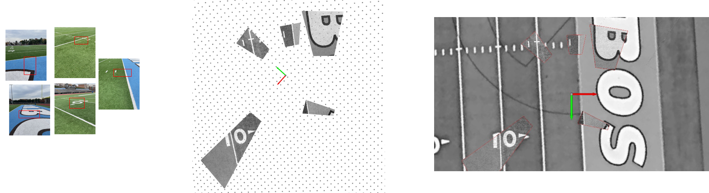

# SurfVAN
Exploiting Structure-from-Motion for Robust Vision-Based Map Matching for Aircraft Surface Movement

Published in: ION GNSS+ 2025
**Presentation Date:** September 11, 2025
*Session D4: Robust Navigation Using Alternative Navigation Sensors and Solutions*

In this paper we introduce a vision-aided navigation (VAN) pipeline designed to support ground navigation of autonomous aircraft. The proposed algorithm combines the computational efficiency of indirect methods with the robustness of direct image-based techniques to enhance solution integrity. The pipeline starts by processing ground images (e.g., acquired by a taxiing aircraft) and relates them via a feature-based structure-from-motion (SfM) solution (COLMAP). A ground plane mosaic is then constructed via homography transforms and matched to satellite imagery using a sum of squares differences (SSD) of intensities. Experimental results reveal that drift within the SfM solution, similar to that observed in dead-reckoning systems, challenges the expected accuracy benefits of map-matching with a wide-baseline ground-plane mosaic. However, the proposed algorithm demonstrates key integrity features, such as the ability to identify registration anomalies and ambiguous matches. These characteristics of the pipeline can mitigate outlier behaviors and contribute toward a robust, certifiable solution for autonomous surface movement of aircraft.

## \*Code and experimentation to be uploaded shortly...\*

---

## Process overview 

### Pose estimation 

### Satellite map view 

### Birds-eye homography projection 

### Satellite registration 

---

## To-Do List

- [ ] Upload necessary images and COLMAP results
- [ ] gNAV agent file finalized with SSD process
- [ ] Finalize demo notebook
- [ ] Add visualization notebook for pose estimations 
- [ ] .yaml file for release 
- [ ] Write final README documentation
